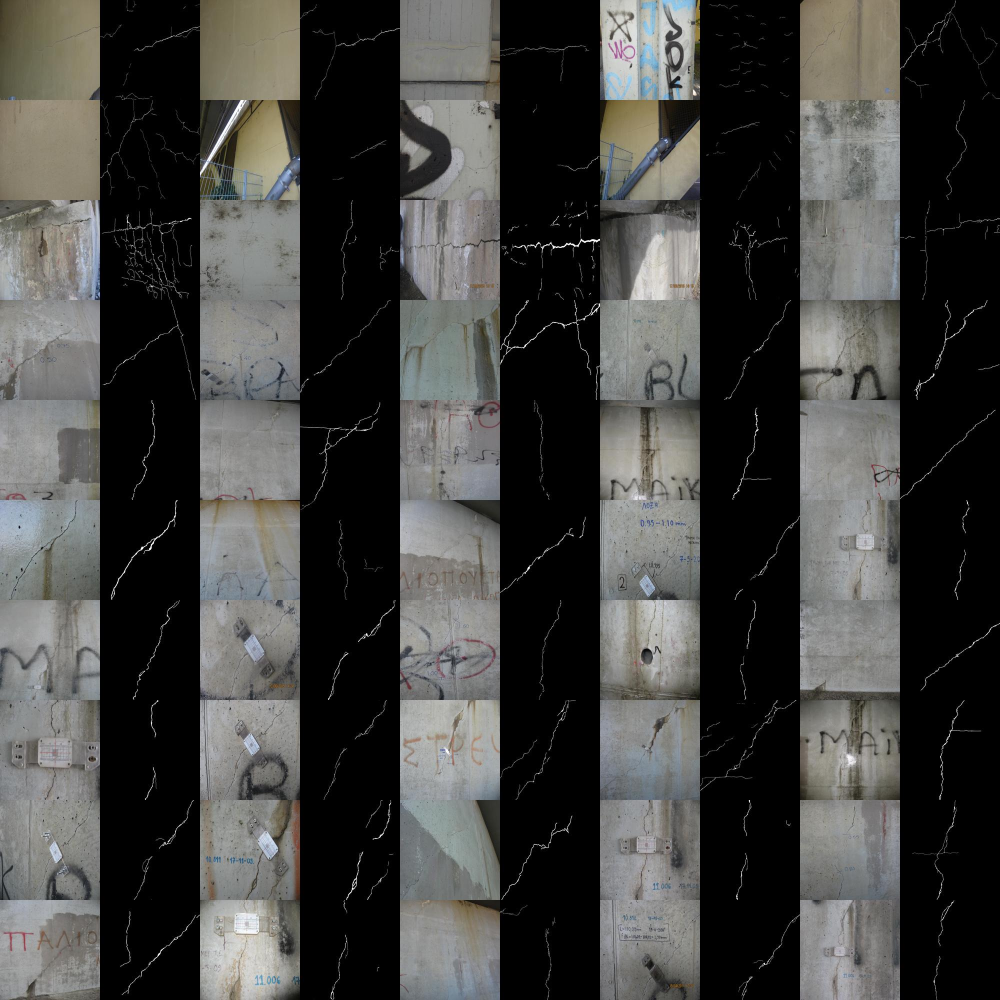

# ConcreteCrackSegmentation Dataset
This repository contains sample images and masks for our concrete crack detection and segmentation framework.  
The full dataset will be uploaded after the paper is published.

## Folder Structure
- `dataset/images/`: Sample crack images.
- `dataset/masks/`: Corresponding masks for the images.

## Dataset Preview
Below is a preview of the dataset (sample images and masks):

## Link to the Paper
If you use this dataset, please cite our paper:  
_"..."_
