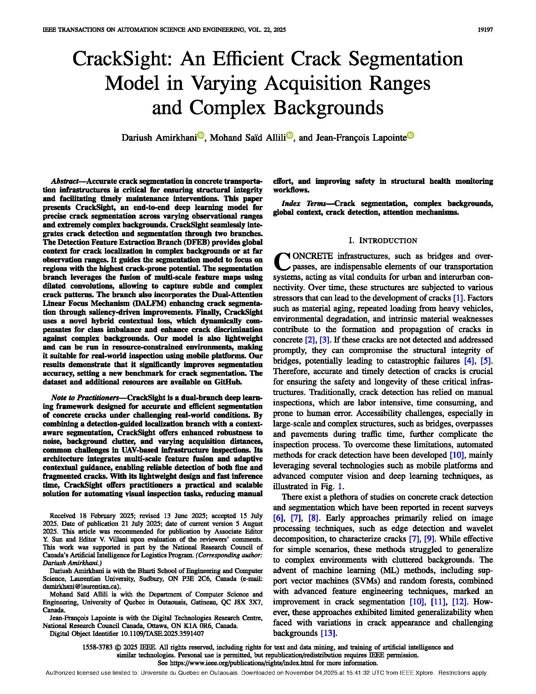
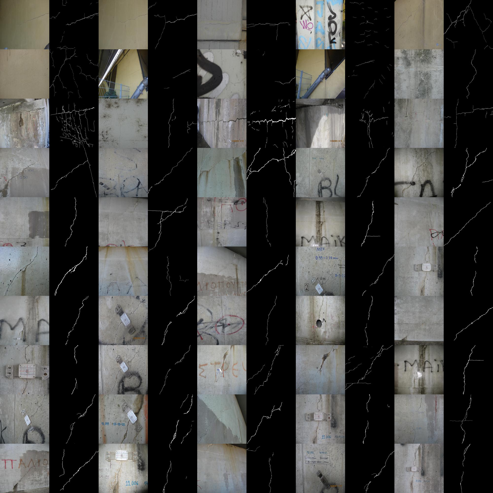

# CrackSight: Concrete Crack Segmentation

[](https://doi.org/10.1109/TASE.2025.3591407)

> **CrackSight: An Efficient Crack Segmentation Model in Varying Acquisition Ranges and Complex Backgrounds**
> Dariush Amirkhani, Mohand Saïd Allili, and Jean-François Lapointe
> *IEEE Transactions on Automation Science and Engineering, Vol. 22, 2025*

### Paper Preview


## 📖 Overview
CrackSight is an end-to-end deep learning model designed for precise crack segmentation across varying observational ranges and extremely complex backgrounds. Accurate crack segmentation in concrete transportation infrastructures is critical for ensuring structural integrity and facilitating timely maintenance interventions.

### Key Features
* **Dual-Branch Architecture**: Seamlessly integrates crack detection and segmentation through two branches.
* **Detection Feature Extraction Branch (DFEB)**: Provides global context for crack localization in complex backgrounds or at far observation ranges, guiding the model to focus on regions with the highest crack-prone potential.
* **Context-Aware Segmentation**: Leverages the fusion of multi-scale feature maps using dilated convolutions to capture subtle and complex crack patterns.
* **Dual-Attention Linear Focus Mechanism (DALFM)**: Enhances crack segmentation through saliency-driven improvements.
* **Hybrid Contextual Loss**: Dynamically compensates for class imbalance and enhances crack discrimination against complex backgrounds.
* **Lightweight & Efficient**: The model can be run in resource-constrained environments, making it suitable for real-world inspection using mobile platforms, such as UAV-based infrastructure inspections.

## 📂 Dataset and Folder Structure
This repository contains the concrete crack images and their corresponding ground-truth masks used to train and evaluate CrackSight.

- `dataset/images/`: Concrete crack images.
- `dataset/masks/`: Corresponding masks for the images.

### Dataset Preview
Below is a preview of the dataset (sample images and masks):



## 📝 Citation
If you use this dataset in your research, please cite our paper:

```bibtex
@article{amirkhani2025cracksight,
  title={CrackSight: An Efficient Crack Segmentation Model in Varying Acquisition Ranges and Complex Backgrounds},
  author={Amirkhani, Dariush and Allili, Mohand Sa{\"i}d and Lapointe, Jean-Fran{\c{c}}ois},
  journal={IEEE Transactions on Automation Science and Engineering},
  volume={22},
  pages={19197--19214},
  year={2025},
  publisher={IEEE},
  doi={10.1109/TASE.2025.3591407}
}
